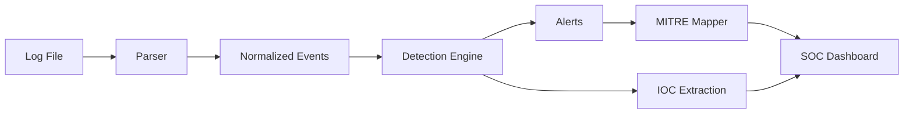

# SOC Threat Detection & Security Monitoring Platform

Beginner-friendly SOC portfolio project that demonstrates practical log analysis, threat detection, alert generation, IOC extraction, MITRE ATT&CK mapping, and security monitoring workflows.

This project is designed for internship applications such as:

- SOC Analyst Intern
- Security Analyst Intern
- Blue Team Intern
- SIEM Analyst Intern
- Cybersecurity Intern

## What It Does

- Uploads and analyzes security log files.
- Parses Apache HTTP logs, JSON/JSONL events, CSV logs, and basic auth/syslog-style records.
- Normalizes logs into consistent security events.
- Detects common SOC scenarios:
  - Failed login events
  - Brute-force activity
  - Suspicious IP watchlist hits
  - Reconnaissance and sensitive path scanning
  - 404 spikes
  - SQL injection attempts
  - XSS attempts
  - Basic request-volume anomalies
- Generates analyst-friendly alerts with evidence and recommendations.
- Maps alerts to MITRE ATT&CK techniques.
- Extracts IOCs such as IP addresses, URLs, domains, and hashes.
- Presents findings in a dark SOC-style dashboard.

## Project Structure

```text
soc-web-platform/
  backend/
    api/                  FastAPI routes
    config/               App settings
    detection_engine/     Detection logic
    mitre_mapper/         MITRE ATT&CK enrichment
    parser/               Multi-format log parser
    sample_logs/          Demo security datasets
    uploads/              Runtime uploads, ignored by git
  detection_rules/        Human-readable detection rule examples
  docs/                   Architecture and improvement planning
  frontend/               React SOC dashboard
  README.md
```

## Backend Setup

```bash
cd backend
python -m venv .venv
.venv\Scripts\activate
pip install -r requirements.txt
uvicorn main:app --reload
```

Backend runs at:

```text
http://localhost:8000
```

Useful endpoints:

- `GET /` - backend health check
- `GET /samples` - list included sample logs
- `GET /analyze-sample/{filename}` - parse and detect threats in a sample log
- `POST /upload` - upload `.log`, `.txt`, `.csv`, `.json`, or `.jsonl`
- `GET /detect/{filename}` - run detection against an uploaded file

## Frontend Setup

```bash
cd frontend
npm install
npm run dev
```

Frontend runs at:

```text
http://localhost:5173
```

The dashboard expects the backend at `http://localhost:8000`. To use a different backend URL, set `VITE_API_BASE`.

## Sample Logs

Included demo datasets:

- `soc_mixed_attack_demo.log` - mixed HTTP attacks, recon, suspicious IPs, and SSH failures
- `auth_bruteforce.jsonl` - structured failed login events
- `web_attacks.csv` - CSV web attack examples

## Example Detection Output

An alert includes:

- Alert ID
- Severity
- Category
- Source IP
- Timestamp
- URL or affected path
- Evidence
- Analyst recommendation
- MITRE ATT&CK tactic and technique

## Architecture



## Screenshots

Add portfolio screenshots here after running the frontend:

- `screenshots/dashboard-overview.png`
- `screenshots/alert-queue.png`
- `screenshots/ioc-panel.png`

## Roadmap

- Add unit tests for parser and detection logic.
- Add SQLite persistence for uploaded files, events, alerts, and triage status.
- Add alert filtering and CSV/JSON exports.
- Add Docker setup for easier demos.
- Add report generation for analyst summaries.
- Add screenshots and a short demo workflow.

## Portfolio Notes

This project is intentionally realistic without pretending to be an enterprise SIEM. It focuses on the blue-team fundamentals interviewers care about: parsing logs, identifying suspicious behavior, explaining detections, mapping to MITRE ATT&CK, and presenting findings in a clear analyst workflow.
