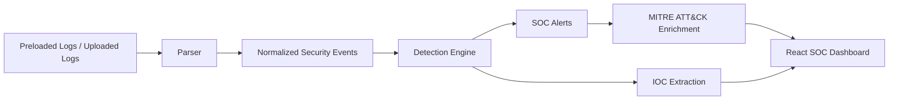

# SOC Threat Detection & Security Monitoring Platform


Beginner-friendly SOC platform that demonstrates practical blue-team skills: log analysis, threat detection, alert generation, IOC extraction, MITRE ATT&CK mapping, and security monitoring workflows.

## Project Overview

This project is built for cybersecurity internship portfolios, especially SOC Analyst, Security Analyst, Blue Team, and SIEM Analyst roles. It avoids fake enterprise complexity and focuses on believable SOC fundamentals:

- Continuous monitoring using preloaded security datasets
- Manual upload support for custom log analysis
- Detection engineering logic that is readable and explainable
- Analyst-friendly alerts with evidence and recommendations
- Dashboard views for monitoring, alert triage, logs, and IOCs

## Features

- Multi-format parsing for Apache logs, auth/syslog-style logs, CSV, JSON, and JSONL
- Simulated live monitoring feed from built-in datasets
- Failed login and brute-force detection
- SQL injection and XSS detection
- Reconnaissance and endpoint scanning detection
- 404 spike and high-frequency request detection
- Suspicious IP and IOC extraction
- Severity classification: Low, Medium, High, Critical
- MITRE ATT&CK mapping
- SOC-style React dashboard with dark cybersecurity theme

## Architecture



## Project Structure

```text
soc-web-platform/
  backend/
  frontend/
  sample_logs/
  detection_rules/
  screenshots/
  docs/
  README.md
  requirements.txt
  .gitignore
```

## Screenshots

Screenshots are stored in `screenshots/`.

- `dashboard-overview.png`
- `alert-queue.png`
- `ioc-table.png`
- `log-viewer.png`

## Detection Examples

| Attack Type | Severity | MITRE ID |
|-------------|----------|----------|
| Brute Force | High | T1110 |
| Failed Login | Low | T1110 |
| SQL Injection | High | T1190 |
| XSS Attempt | High | T1190 |
| Reconnaissance | Medium | T1595 |
| 404 Spike | Medium | T1595.002 |

Each alert includes timestamp, severity, attack type, source IP, event description, evidence, recommendation, and MITRE ATT&CK mapping.

## Setup Instructions

### Backend

```bash
cd backend
python -m venv .venv
.venv\Scripts\activate
pip install -r requirements.txt
uvicorn main:app --reload
```

Backend URL:

```text
http://localhost:8000
```

### Frontend

```bash
cd frontend
npm install
npm run dev
```

Frontend URL:

```text
http://localhost:5173
```

## Usage Guide

1. Start the backend.
2. Start the frontend.
3. Open the `Monitoring` tab for the simulated live SOC feed.
4. Use `Overview` for severity, MITRE, and threat metrics.
5. Use `Alerts` to review generated detections.
6. Use `Log Analysis` to inspect normalized event evidence.
7. Use `IOCs` to review suspicious IPs, URLs, domains, and hashes.

Useful API routes:

- `GET /samples`
- `GET /analyze-sample/{filename}`
- `GET /monitoring/live`
- `POST /upload`
- `GET /detect/{filename}`

## Documentation

- [Architecture](docs/architecture.md)
- [Detection Guide](docs/detections.md)
- [Setup](docs/setup.md)
- [Usage](docs/usage.md)
- [Improvement Plan](docs/IMPROVEMENT_PLAN.md)

## Future Improvements

- SQLite persistence for alerts, events, uploads, and triage status
- Alert filtering and case status workflow
- CSV/JSON alert and IOC exports
- Docker setup for easier demos
- Report generation for SOC summaries
- Unit tests for parser and detection logic

## Resume Alignment

This repository supports resume claims around threat detection, security monitoring, log analysis, SOC workflows, MITRE ATT&CK, SIEM concepts, and IOC identification.
