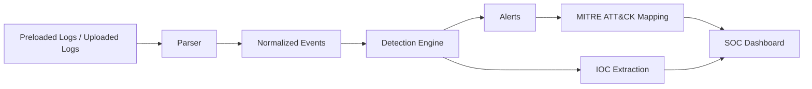

# Architecture

The platform follows a simple SOC monitoring pipeline:

## Components

- `backend/parser/` normalizes Apache, CSV, JSON/JSONL, and auth/syslog-style logs.
- `backend/detection_engine/` generates SOC alerts from normalized events.
- `backend/mitre_mapper/` enriches alerts with MITRE ATT&CK context.
- `backend/api/` exposes upload, sample analysis, and simulated live monitoring endpoints.
- `frontend/` presents analyst-focused monitoring, alert, log, and IOC views.
- `sample_logs/` stores portfolio-ready demo datasets.
- `detection_rules/` documents detection logic in a recruiter-readable format.

## Design Goal

This is intentionally not an enterprise SIEM clone. It is a practical student SOC platform that shows log parsing, threat detection, alert triage, IOC identification, and MITRE mapping.
